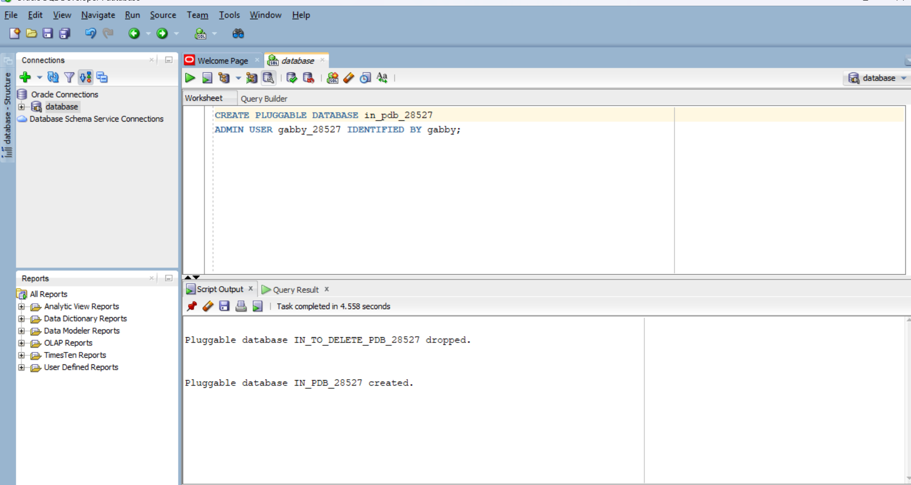
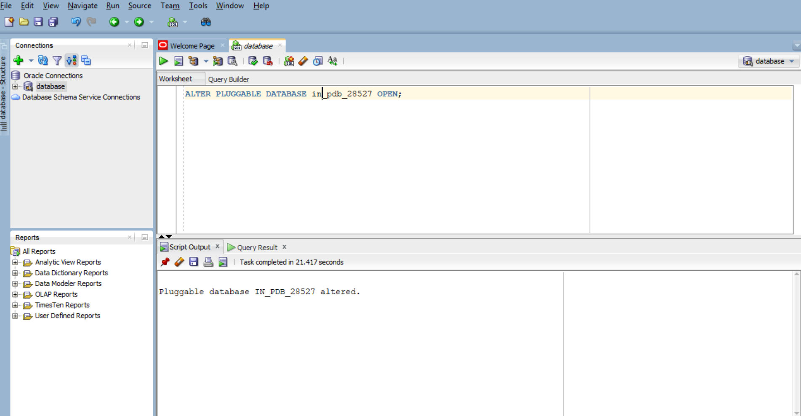
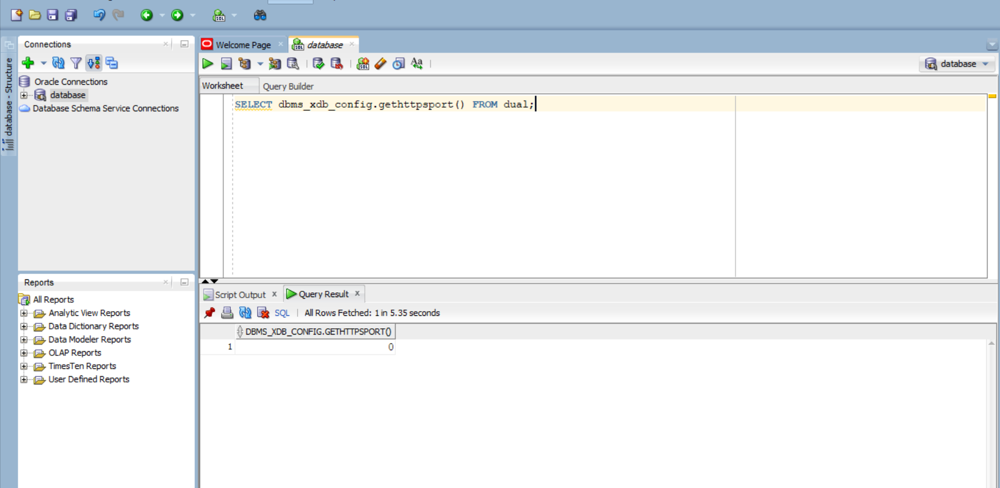
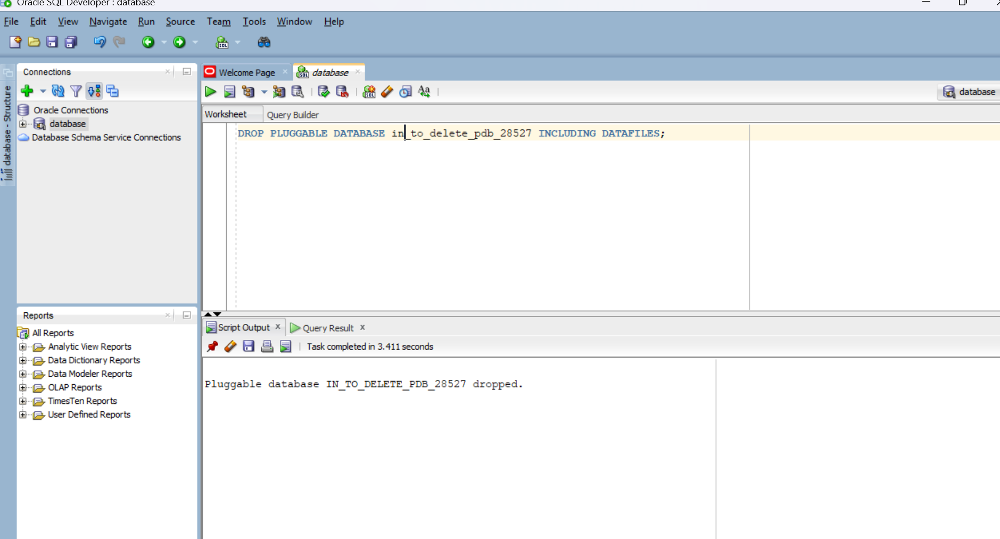
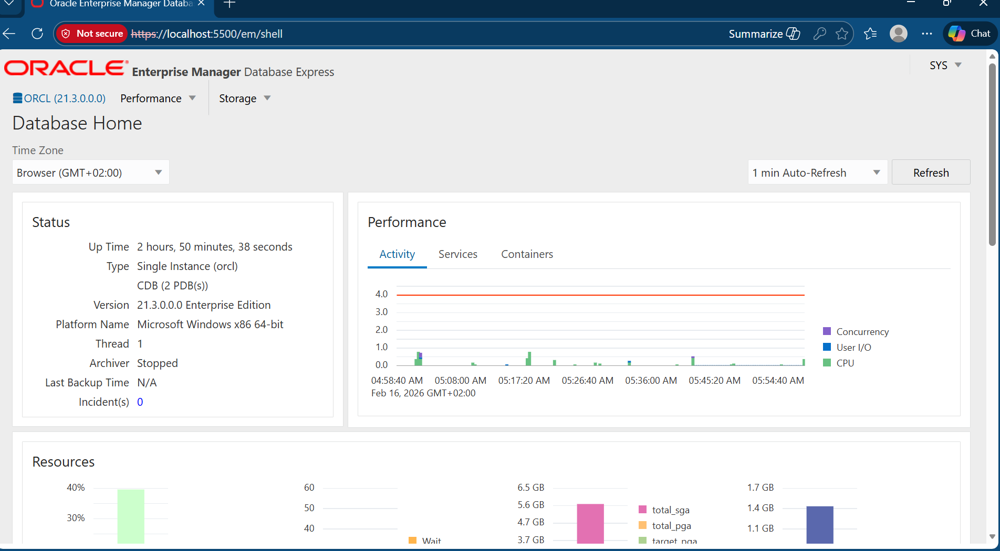

# oracle_pdb_ass_II_28527_ineza
Oracle Pluggable Database Management Assignment - INSY 8311
# Oracle Pluggable Database (PDB) Management Assignment

## Student Information
- **Name:** INEZA Lisa Gabrielle
- **Student ID:** 28527
- **Course:** Database Development with PL/SQL (INSY 8311)
- **Group:** A
- **Class Schedule:** Wednesday Evening
- **Instructor:** Eric Maniraguha
- **Assignment:** Individual Assignment II
- **Submission Date:** February 16, 2026

---

## 📋 Table of Contents
1. [Assignment Overview](#assignment-overview)
2. [Oracle Environment](#oracle-environment)
3. [Task 1: Create a New Pluggable Database](#task-1-create-a-new-pluggable-database)
4. [Task 2: Create and Delete a PDB](#task-2-create-and-delete-a-pdb)
5. [Task 3: Oracle Enterprise Manager (OEM)](#task-3-oracle-enterprise-manager-oem)
6. [Challenges Encountered and Solutions](#challenges-encountered-and-solutions)
7. [Key Learnings](#key-learnings)
8. [Academic Integrity Statement](#academic-integrity-statement)

---

## Assignment Overview

This assignment shows the practical work I did while learning how to manage Pluggable Databases (PDBs) in Oracle Multitenant Architecture. The tasks were done step by step using Oracle Database 21c on my computer.

- Creation and configuration of Pluggable Databases
- User management within PDBs
- PDB lifecycle management (creation and deletion)
- Oracle Enterprise Manager (OEM) configuration and usage
- Professional technical documentation practices

**Objective:** To gain foundational skills in Oracle database administration that will be essential for future PL/SQL laboratory sessions, quizzes, and examinations.

---

## Oracle Environment

**Database Version:** Oracle Database 21c  
**Operating System:** Windows 11  
**Oracle Home:** C:\app\oracle\product\21c\dbhomeXE  
**Container Database (CDB):** XE


### Environment Verification
The Oracle 21c environment was verified and confirmed operational before beginning the assignment tasks.

---

## Task 1: Create a New Pluggable Database

### Naming Conventions Used
Following the assignment's strict naming requirements:

- **PDB Name:** `in_pdb_28527`
  - Format: `FirstTwoLettersOfFirstName_pdb_StudentID`
  - Explanation: "in" from **IN**EZA + "_pdb_" + student ID
  
- **Username:** `ineza_28527`
  - Format: `FirstName_plsqlauca_StudentID`
  - Explanation: Full first name in lowercase + "_ " + student ID
  
- **Password:** [Confidential - stored securely]

### Implementation Steps

1. **Connected to CDB as SYSDBA**
   ```sql
   sqlplus / as sysdba
   ```

2. **Created the Pluggable Database**
   ```sql
   CREATE PLUGGABLE DATABASE in_pdb_28527
   ADMIN USER pdb_admin IDENTIFIED BY [password]
   FILE_NAME_CONVERT = ('[source_path]', '[target_path]');
   ```

3. **Opened the PDB**
   ```sql
   ALTER PLUGGABLE DATABASE in_pdb_28527 OPEN;
   ```

4. **Verified PDB Status**
   ```sql
   SELECT pdb_name, status FROM dba_pdbs WHERE pdb_name = 'IN_PDB_28527';
   ```

5. **Connected to the PDB**
   ```sql
   ALTER SESSION SET CONTAINER = in_pdb_28527;
   ```

6. **Created User Account**
   ```sql
   CREATE USER ineza_plsqlauca_28527 IDENTIFIED BY [password];
   GRANT CONNECT, RESOURCE, DBA TO ineza_plsqlauca_28527;
   ALTER USER ineza_plsqlauca_28527 QUOTA UNLIMITED ON USERS;
   ```

### Evidence

#### PDB Creation Command


#### PDB Open State


#### User Created Inside PDB


#### User Verification


---

## Task 2: Create and Delete a PDB

### Temporary PDB Naming Convention

- **Temporary PDB Name:** `in_to_delete_pdb_28527`
  - Format: `FirstTwoLettersOfFirstName_to_delete_pdb_StudentID`

### Implementation Steps

1. **Created Temporary PDB**
   ```sql
   CREATE PLUGGABLE DATABASE in_to_delete_pdb_28527
   ADMIN USER temp_admin IDENTIFIED BY [password]
   FILE_NAME_CONVERT = ('[source_path]', '[target_path]');
   ```

2. **Opened the Temporary PDB**
   ```sql
   ALTER PLUGGABLE DATABASE in_to_delete_pdb_28527 OPEN;
   ```

3. **Verified PDB Existence**
   ```sql
   SELECT pdb_name, status FROM dba_pdbs WHERE pdb_name = 'IN_TO_DELETE_PDB_28527';
   ```

4. **Closed the PDB Before Deletion**
   ```sql
   ALTER PLUGGABLE DATABASE in_to_delete_pdb_28527 CLOSE IMMEDIATE;
   ```

5. **Deleted the PDB**
   ```sql
   DROP PLUGGABLE DATABASE in_to_delete_pdb_28527 INCLUDING DATAFILES;
   ```

6. **Confirmed Deletion**
   ```sql
   SELECT pdb_name FROM dba_pdbs WHERE pdb_name = 'IN_TO_DELETE_PDB_28527';
   -- Should return no rows
   ```

### Evidence

#### Temporary PDB Creation


#### PDB Existence Verification


#### PDB Deletion Process



## Task 3: Oracle Enterprise Manager (OEM)

### OEM Configuration

I used Oracle Enterprise Manager Database Express (EM Express) to check my database status and view the PDBs. It helped me confirm that my PDBs were created and opened correctly.

### Access Details

- **OEM URL:** `https://localhost:5500/em`
- **Login:** SYSDBA credentials
- **Dashboard:** Displays all PDBs, performance metrics, and administrative controls

### Implementation Steps

1. **Verified OEM Port Configuration**
   ```sql
   SELECT DBMS_XDB_CONFIG.GETHTTPSPORT() FROM DUAL;
   ```

2. **Configured OEM Port (if needed)**
   ```sql
   EXEC DBMS_XDB_CONFIG.SETHTTPSPORT(5500);
   ```

3. **Accessed OEM Dashboard**
   - Opened browser and navigated to OEM URL
   - Logged in with SYSDBA credentials
   - Verified PDB visibility and status

### Evidence

#### OEM Dashboard Overview



## Challenges Encountered and Solutions

### Challenge 1: Oracle Installation and Setup Issues

**Problem:**  
Oracle 21c installation failed because old Oracle XE files and registry entries were still on my PC.

**Solution:**  
- I uninstalled Oracle from Control Panel  
- I manually deleted remaining Oracle folders in `C:\app`  
- I removed Oracle registry keys from `HKEY_LOCAL_MACHINE\SOFTWARE\Wow6432Node`  
- After cleaning the system, the installation worked successfully


**Learning:** Understanding the importance of meeting all system prerequisites and following installation procedures methodically.

---

### Challenge 2: Oracle Enterprise Manager (OEM) Configuration Issues

**Problem:** OEM Dashboard was initially inaccessible due to [specific issue - e.g., port not configured, HTTPS not enabled, or service not running].

**Solution:**
- Checked OEM HTTPS port configuration using `DBMS_XDB_CONFIG.GETHTTPSPORT()`
- Configured the port using `DBMS_XDB_CONFIG.SETHTTPSPORT(5500)`
- Verified database listener was running: `lsnrctl status`
- Restarted necessary services
- Cleared browser cache and accessed OEM successfully

**Learning:** OEM configuration requires proper port setup and service verification. The DBMS_XDB_CONFIG package is essential for OEM Express management.

---

### Additional Observations

- **File Path Handling:** Ensuring correct FILE_NAME_CONVERT paths was crucial for PDB creation
- **Naming Conventions:** Strict adherence to the specified naming format prevented potential errors
- **Documentation:** Taking screenshots immediately after each successful command ensured accurate evidence collection

---

## Key Learnings

Through this assignment, I have gained practical understanding of:

1. **Oracle Multitenant Architecture**
   - Understanding the relationship between CDB and PDBs
   - How CDB and PDB work together and why Oracle uses PDBs instead of separate databases
2. **PDB Lifecycle Management**
   - Creating, opening, closing, and deleting pluggable databases
   - Managing PDB states and verifying status

3. **User Management in PDBs**
   - Creating users within specific containers
   - Granting appropriate privileges and quotas
   - Understanding container-specific user context

4. **Oracle Enterprise Manager**
   - Configuring and accessing OEM Database Express
   - Using OEM for database monitoring and administration
   - Navigating the OEM dashboard interface

5. **Professional Documentation**
   - Importance of clear, structured technical documentation
   - Using GitHub for version control and professional presentation
   - Following naming conventions and standards rigorously

6. **Problem-Solving Skills**
   - Troubleshooting installation and configuration issues
   - Using Oracle documentation and error messages effectively
   - Systematic approach to resolving technical challenges

---

## Academic Integrity Statement

I, INEZA Lisa Gabrielle (Student ID: 28527), declare that:

- This assignment represents my own practical work  
- All SQL commands were executed by me on my own Oracle 21c installation  
- All screenshots were taken from my own computer  
- I followed the course instructions and naming conventions  
- Any external references were used only for learning purposes  

I completed this assignment to develop genuine understanding of Oracle PDB management, which will be essential for my future work in database development and administration.

**Signature:** INEZA Lisa Gabrielle  
**Date:** February 16, 2026

---

## Repository Structure

```
oracle_pdb_ass_II_28527_ineza/
│
├── README.md                          # This file
│
└── screenshots/
    ├── creation.png        # PDB creation command
    ├── open_state.png     # PDB open state
    ├── creation.png       # User creation
    ├── verification.png   # User verification
    ├── creation_temp.png   # Temporary PDB creation
    ├── exists.png          # PDB existence verification
    ├── drop.png        # PDB deletion command
    ├── verified_oem_configuration.png  # Deletion confirmation
    ├── dashboard.png       # OEM dashboard
---

## Additional Notes

This assignment has strengthened my foundation in Oracle database administration and prepared me for:
- Future PL/SQL laboratory sessions
- Practical quizzes and examinations
- Real-world database management scenarios
- Professional database development projects
